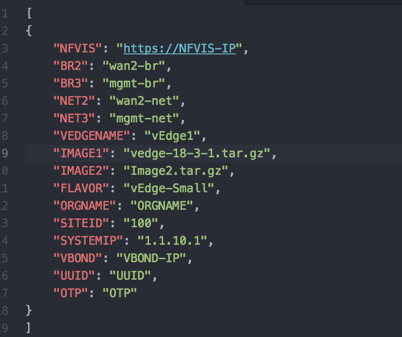
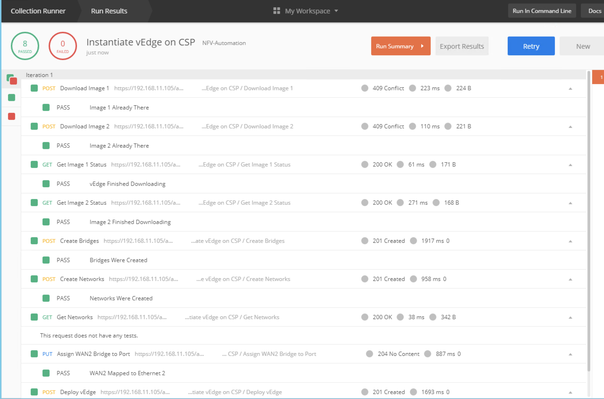

## NFV-Automation

### Investigating Collection Runner

Collection Runner allows us to do a couple of things.  

1. It will step through each of the API calls sucessively in either a collection or a folder inside a collection.  This would permit us to step through each step inside our Instantiation folder.  
2. It allows us to import a source file that can be used to populate variables as part of the run through the collection or folder.  
3. If that source file contains multiple entries for the variables, it allows us to iterate through the collection or folder until it has completed all the instances inside the source file.

This means that for deploying VNFs to our NFVIS, we can use a source file that would provide data for just one NFVIS, or we can make a file that would include multiples and Postman would push the API calls to each device.  We would have automated instantiating our VNF(s) into all the devices in our list.

We are going to use the file called **NFVIS-postman-data.json** to provide this source file.  If you open this file and take a look at its contents, you will see have a set of data structured in JSON format for one NFVIS.  

These listed variables will all be used during the different API calls that are part of the folder.  You can change any of these to meet your needs as part of your deployment.  Note that the final six variables are specific to a vEdge deployment and are mostly contained in your vManage's **cloud.init** bootstrap file.  

To launch Collection Runner, click on the **Runner** button in the top left of Postman.  This will launch a new window that is the Collection Runner tool.  

In this new window, expand the **NFV Automation** collection until you get into the Instantiate vEdge on CSP folder.  Then select the NFV-Automation Environment as the environment.  Lastly, next to the **Data** section, click on Select File and choose the JSON structured data file we modified earlier titled ***NFVIS-Postman-Data.json***.  The data file type is "application/json".

We are now ready to run the collection to instantiate our VNF(s) onto the CSP.  Click on the Blue Button to Run the collection.  You will see Postman report its steps as it executes one API after another to finish deploying the VNF.

A more careful investigation of the list of tasks executed as part of this deployment will reveal that some of these tasks were not executed in the same order as they appear in the folder.  This warrents a deeper look into one other key feature of Postman, how to set tests that provide for more complex capabilites inside a Collection.

### [Next Step - Digging into Tests with Postman](Module4.md)