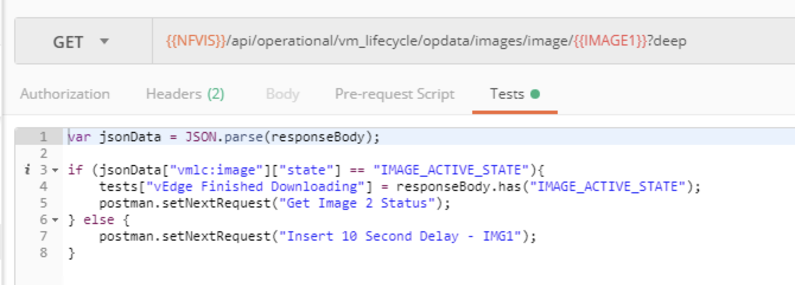

## NFV-Automation

### Digging into Tests with Postman

Let's take a moment to return to the REST APIs that were created to make this collection work.  Tt here is another aspect of Postman that allows it to execute a more programmatic flow of calls than just simply executing them successively.  This aspect is **Tests**.  

Returning to our Collection, and selecting the first API call once more "Download Image 1", select the Tests tab under the API itself, this is the final tab.


These Tests allow simple additional javascript coding after the API call is executed.  In this first API, we can see that the here we are simply running a check to validate we receive the correct HTML response code for downloading the image file.  A 409 indicates the file is already present in NFVIS, and a 201 indicates that the REST call was sucessfully starteed.  The keyword ```tests``` in this code snippet is actually used by Postman to provide a pass or fail check on the named test in parenthesis.  This way, when you run a collection of APIs, tests like this can be run at each stage along the way to validate whether the API call worked correctly or didn't.  

Barring any additional direction, once this call is complete, Collection Runner will simply execute the next successive API call, which in this case will be "Download Image 2."  Examining this call shows that it is very similar to the first API call.

Examining the next API, "Get Image 1 Status" shows a little more extra code in its Tests section.



What this snippet of script is doing is simply checking the value of the "state" field from the returned data and validating whether the image is in an "active" state.  After making this check, there are two possible outcomes.  If it is active, we tell Postman Collection Runner to set the next API call to now be "Get Image 2 Status", if not, we set the next call to be "Insert 10 Second Delay - IMG1".

This command of setting the next request allows us to creat a more intelligent flow of calls based on returned data.  

A further examination of the Tests run in the next few API calls will show we are simply checking to see if the image has become active yet, and if not insert a 10 second delay and try the API call again.  Once image 1 is active, move on to checking image 2.  Once that image is also active, move on to creating the virtual briges in NFVIS that will be used for connectivity and service chaining of our VNF(s).

These next few calls create the virtual briges, then create the virtual networks (which get mapped to the bridges) then link one of the physical ports on the CSP to the newly created wan2-br bridge.

The final call in this collection is to spin up the vEdge image.  This API call has a lot of content in its body since there are many options for spinning up this VNF.  Examining this will show this is where the remaining variables for instantiating the vEdge get used.  Details for all the aspects of the body of data are outside the scope of this example, but it can provide a bit of guidance as to how you might instantiate your own VNFs with its appropriate variables.

  