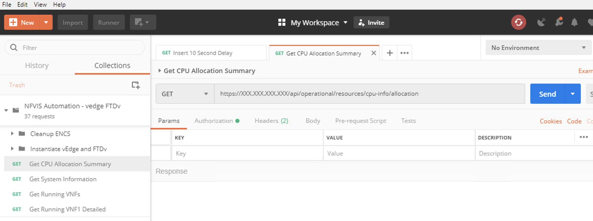
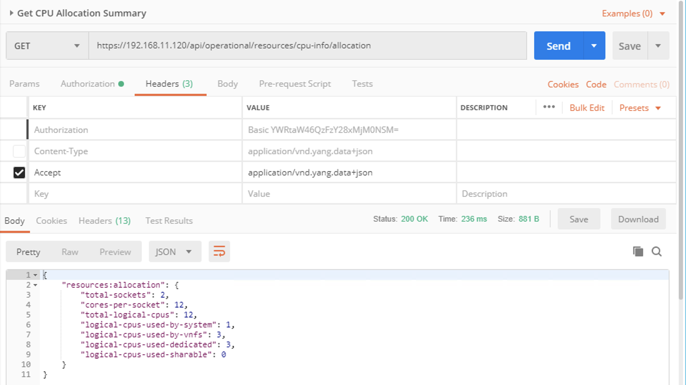

## NFVIS Automation - vEdge & FTDv

### Introducing the NFVIS REST API 

The files inside the code folder contain an environment file, a collection file,
an input data file, and a JSON data file that contains additional variables for the deployment.

The environment file and collection file can be imported into your local Postman
application.  These setup the various APIs that will be used as part of the testing.  Simply select the "Import" button on the top left of the Postman application.  Then add the two files: **NFVIS Auto - vedge FTDv.postman_environment.json** and **NFVIS Automation - vedge FTDv.postman_collection.json**.

After importing the files, examine the Collection that has been imported by clicking on the Collection tab next to the History tab near the top left of the application.  

The power of Postman is that not only does it provide a GUI representation of the REST API calls, it can be used to set variables for calls, extract data from data returned by an API call, script a sequence of calls in a meaningful order, and provide some basic programming to automate sending data and receiving data from devices.  

The Collection just imported is comprised of two folders and several stand-alone API calls.  We'll skip the folders for now and examine the other API calls.  Select the API **Get CPU Allocation Summary**.  This will bring that API call to the main work space of Postman.  Here you can note the method for this API call is listed as *GET* and the actual API is then listed to the right of that.

This is a very basic REST call where we are using the IP address of the platform.  To test out this API call, you need to change the IP address in the header to the IP address of your NFVIS platform.  Directly under the API call is a set of tabs.  If you select the *Authorization* tab, you can see that this API call has been set to a Basic Auth method and the username and password are filled out.  You will also need to change these values to the ones for your system.  Finally, the *Headers* tab provides information on both how additional data will be sent to the system for API calls and how Postman wants to see returned data displayed.  For NFVIS, you can have data sent and received in either JSON or XML formats.  For this lab, I have selected to use JSON.  

If you select the **Send** blue botton next to the API, Postman will execute the API call.  You will see information about the usage of the CPU by both the system and VNFs according to the platform. 

**Note** - If you get an error message about SSL connections being blocked, it means Postman is seeing the site as having an invalid certificate.  If you want to get around this, navigate inside Postman to *File -> Settings -> General* and ensure **SSL Certificate Validation** is disabled.  

### [Next Step - Environment Variables and Collection Settings](Module2.md)
