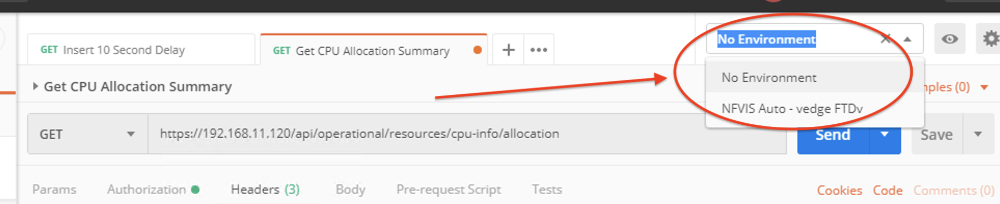
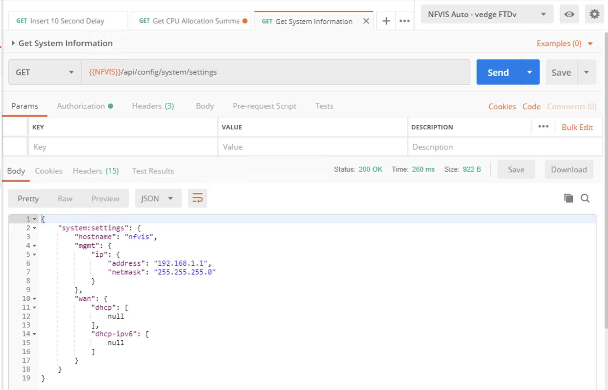
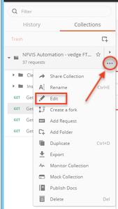
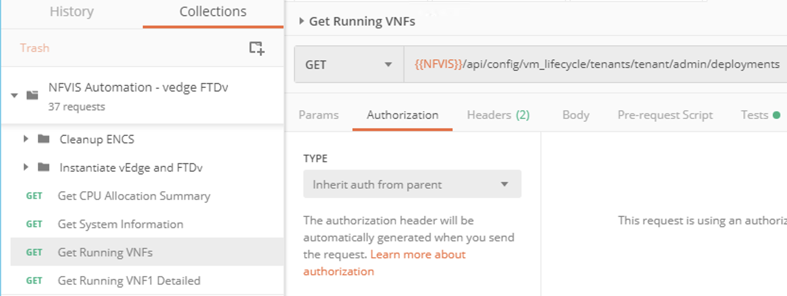
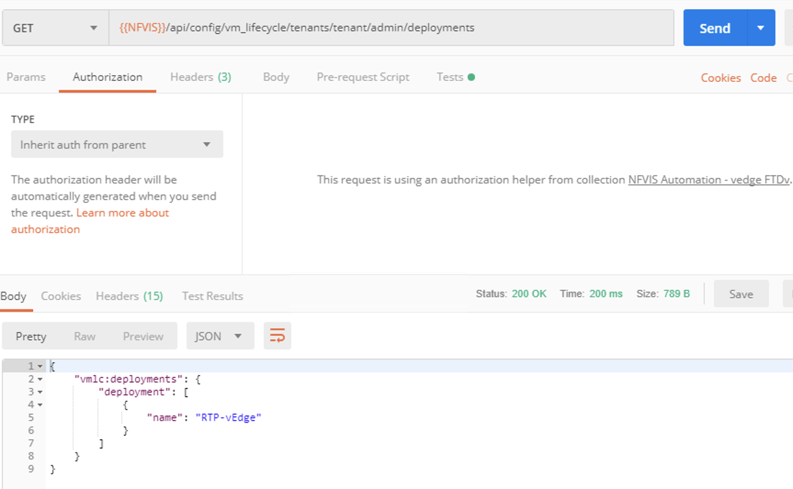

## NFVIS Automation - vEdge & FTDv

### Environment Variables and Collection Settings

In API calls, like the one done in the last module, some device specific information had to be included.  What if we wanted to use an API call to multiple devices?  We could change the IP address in each of the REST calls.  This might not be a big deal if there were only a couple of APIs, but what if there are dozens or more?  Changing this in each of those APIs would be very cumbersome.  We simplify this by using variables. 

One method for using variables in Postman is through the Environment.  An Environment is a set of variables defined for the particular test case that the APIs are to be run against.  The Environment can be changed by selecting the pull down menu at the top right of the screen.  An environment was one of the files imported earlier.

You can view all the variables set for this Environment by selecting the eyeball icon next to the pulldown menu for selecting the Environment.  If you examine these, you will note that one of the variables is the IP address of the NFVIS.  Change this one to match the IP address of your NFVIS.

By selecting the next API call in the list **Get System Information** you can see that the variable is being used in lieu of putting the exact IP address for the NFVIS.  Go ahead and execute this API call by clicking on the blue **Send** button and note how this one returns some basic information about your platform.  Notice how this data is returned in a JSON format.

Aside from setting variables in the Environment area, variables can also be set for the Collection.  By clicking on the ellipsis to the right of the Collection name, a menu will provide additional options for this Collection.  Select Edit to make changes.  

Under this window, select the tab for **Authorization** and modify the username and password to those of your system.

This change will allow all the API calls in the Collection to default to this username and password, so that, in the event, you need to simply change either of them, you can do it here for the entire collection without needing to modify it under each specific API call.

Now, the next test call to try is **Get Running VNFs**.  Select that one and look at the in information under the *Authorization* tab.  Note that instead of the type being set to *Basic Auth*, it is set to *Inherit from parent*.  This is how we let the API call know to use the values inside the Collection settings.  

Clicking on the Send button executes this API call.

### [Next Step - Dynamically Assigning Environment Variables](Module3.md)

