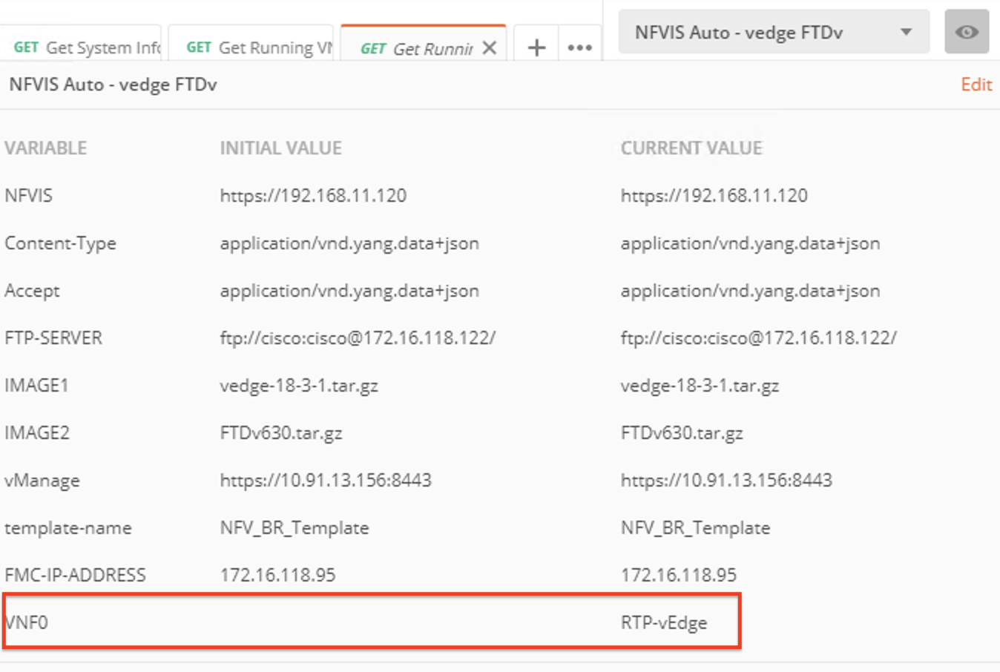
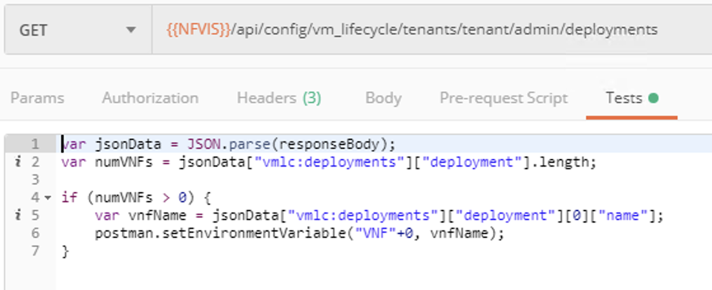
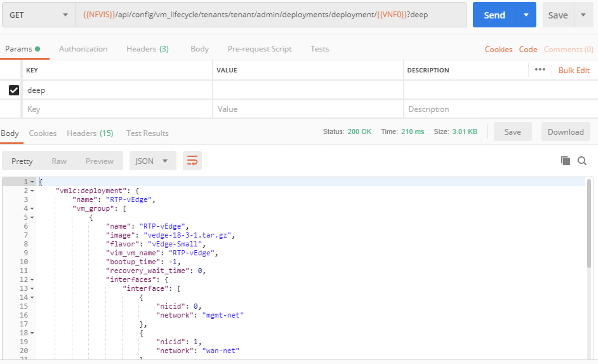

## NFVIS Automation - vEdge & FTDv

### Dynamically Assigning Environment Variables

Another important feature of Postman is using output from returned API calls to do something.  One thing we can do with returned data is set variables.

Select the last of our stand-alone APIs **Get Running VNF1 Detailed**.  This is another *GET* request, but notice in this one, there is an additional variable set inside the call.  This new variable is **VNF0**.  That variable was never set in the Environment or Collection Variables.  Yet, if you look at the Environment variables now, you will note that it is there now.  

This variable was populated by using data returned in the previous API call.  Select the API **Get Running VNFs** and select the *Tests* tab listed below the API call.  We've got some basic Javascript written in here.  

Reading through this code snippet, Postman is taking the returned data and parsing it.  Then it is finding the number of VNFs, and as long as there is at least one VNF, it grabs the value for the VNFs name and assigns it to a Postman EnvironmentVariable called "VNF0".  This can be done because we are using JSON structured data as our returned data and it makes it easy to parse through it and find the values we want.

Looking back at that last API in the list **Get Running VNF1 Detailed**, apart from the second variable, there is also a *Parameter* included called "Deep".  This can be seen in the *Params* tab.  

Now, execute this API and note we are getting more detailed information returned about the running VNF.  

### [Next Step - Walking Through the Instantiate Collection](Module4.md)