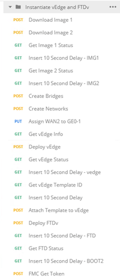
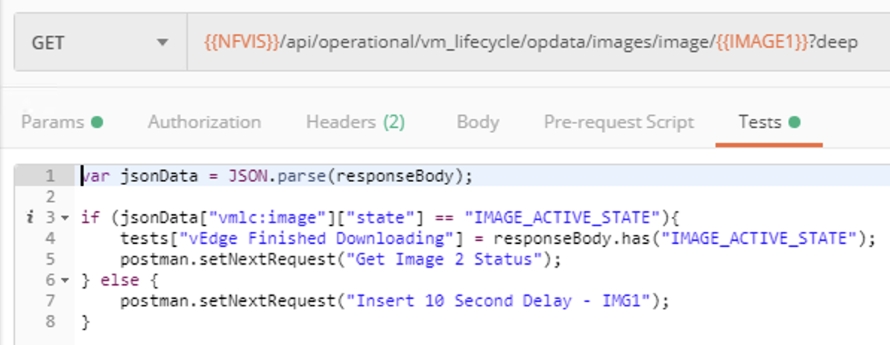
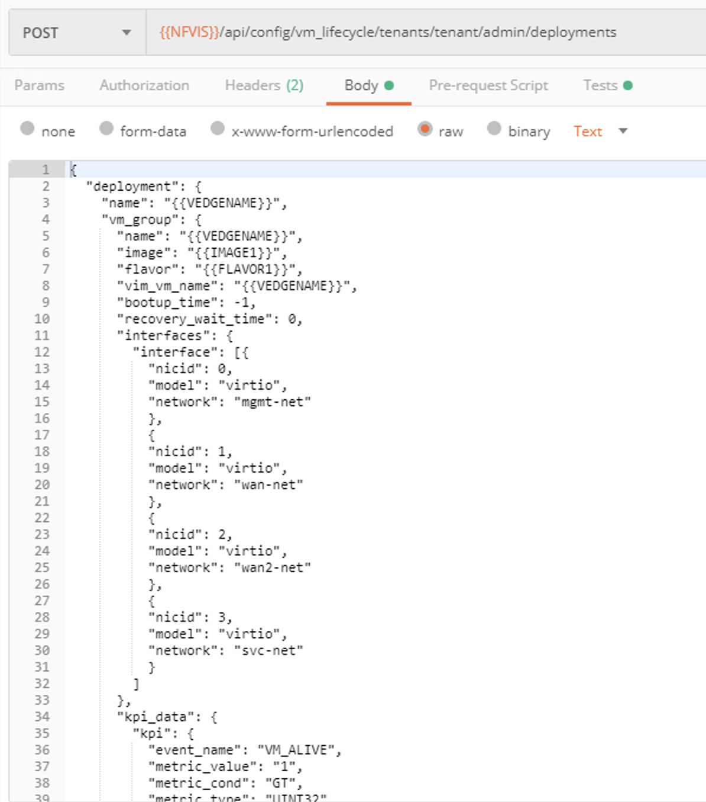

## NFVIS Automation - vEdge & FTDv

### Walking Through the Instantiate Collection

Now, expand the *Instantiate vEdge and FTDv* folder and see that it contains a series of API calls used to instantiate both the vEdge and the vFTD on NFVIS. 

The list is a series of API calls that would be executed serially in order to build up the components inside NFVIS such as downloading the image, creating the virtual bridges and networks, and mapping those virtual networks to the correct physical interface on the platform.  Once those components are enabled, the it then spins up the vEdge.  Next, the Postman Collection then begins querrying vManage using REST API calls to determine when the vEdge has finished registering to vManage, grab information about the template that needs to be applied to the device, then tells vManage to push that template to the vEdge.  Finally, it spins up the FTDv, and executes a few REST API calls to FMC to get a security token that allows Postman to execute REST calls to the FMC, and then determine the policy that should be assigned to the FTDv once it registers.  

This ordering of calls inside the folder is important because Postman also includes the ability to automatically sequence API calls in order to better automate scripts on the system.  In order to execute a series of calls, there is a tool called Collection Runner.  When Runner is used, it will, by default, execute each API in a selected folder sequentially starting at the top.

The first two API calls are just downloading images onto the NFVIS platform.  So they are fine to execute sequentially.  However, looking at the 3rd call, **Get Image 1 Status** we are using an API here to see if the image finished downloading yet.  Looking at the *Tests* tab, the code snippet here is parsing the returned JSON data for the value in the *state* key.  If the value there is *IMAGE_ACTIVE_STATE* then it knows the image has finished downloading and registered to NFVIS.  in this case, we are using an additional feature of Runner to tell Postman, which API call to execute next.  We use the **postman.setNextRequest()** function to direct the next API to be used rather than just letting Runner move to the next call sequentially.  In this case it would skip over the next call, and move to the **Get Image 2 Status** call.  In the event the image hasn't finished registering yet, we tell Postman to set the next request to **Insert 10 Second Delay - IMG1**.  

Looking at that call, we are setting a 10 second delay, and then setting the next request to go back to **Get Image 1 Status**.  This way we are creating a loop until the image finishes registering.  

Let's take a deeper look at the API that actually spins up the vEdge.  Select the one titled **Deploy vEdge**.  This is a *POST* action, so we expect there will be some additional data contained in the Body of the call.  Clicking on the Body tab will show us what we have to pass to NFVIS to make this API call successful.  

There's a lot of data put into this body section.  Using structured data formats like XML or JSON make it much easier to understand.  Scrolling through this body section, you can note there are several variables included as part of this data set.  These variables can be populated by assigning them values through either the Environment Variables or Collection Variables areas examined earlier.  However, what if you wanted to deploy many of these devices?  Going through the variable sections we have explored so far and changing values there wouldn't be very efficient.  In the section **Investigating Collection Runner**, we will examine one more way to populate variables that will solve this issue.

For the next step here, we will need to explore how to use the APIs in vManage to complete the automation for our vEdge's onboarding process.

### [Next Step - Using APIs to Deploy vManage Templates](Module5.md)