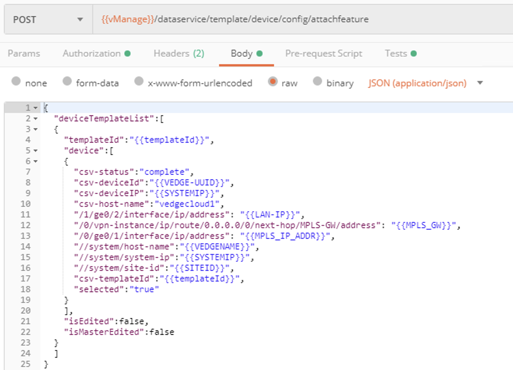
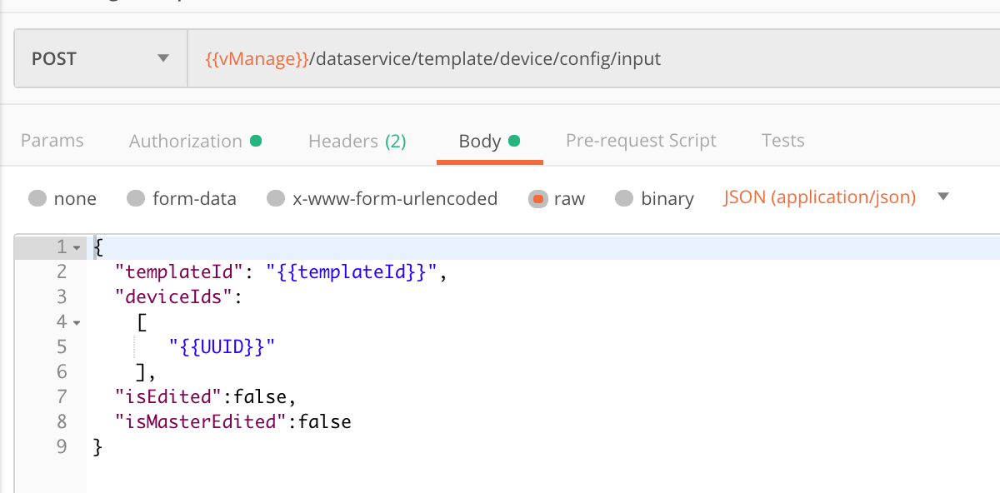
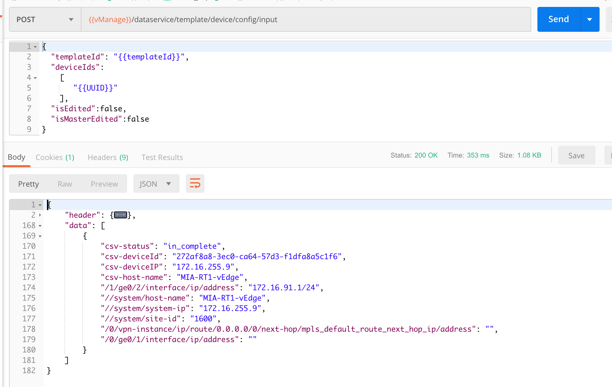

## NFV-Automation

### Using APIs to Deploy vManage Templates

Once the vEdge is spun up on NFVIS, it will automatically register to the vManage.  This is because the body of data provided as part of the vEdge deployment included the details of its vBond, Organization Name, UUID, and OTP to allow it to successfully register.  Some of these variables are included in the Environment Variables.  Some are not, and in the next section, we'll go through that method of providing variables outside of the Collection or Environment.

Now we want to complete the vEdge's registration and allow vManage to push the template that should be part of the vEdge's configuration.  We want to automate this in order to allow instantiation without any user intervention.

Looking at the API **Attach Template to vEdge**, note this is another POST action.  As such, data should be included as part of the API call to tell it exactly what to POST.  In the *Body* tab of this API, we see variables.  Among these variables are the templatId and several device specific variables needed to successfully implement the template.

You can run any vManage template you want to finish deploying your vEdge, but how do you get this list of variables from your template?  One method of doing this is to execute an API against vManage to determine all the variables that have been assigned against a running vEdge using the template.  This is a POST API, and is: **{{vManage_IP}}/dataservice/template/device/config/input**

Executing this one returns the following information:

Inside the data section of the returned information, there is a list of variables needed for the template to successfully deploy.  This information would need to be copied and inserted into the *Body* section of the API used to push the template.

In our next step we will examine how Collection Runner can allow an alternate means of simplifying variable assignment as well as allow the series of API calls to be run in multiple iterations in the event you need to deploy more that one device.

### [Next Step - Investigating Collection Runner](Module6.md)